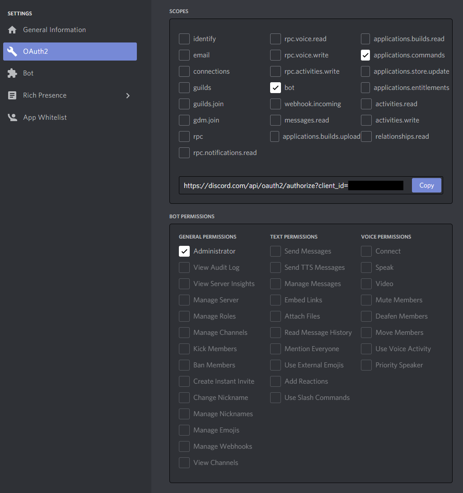

# Setting up a Discord bot

You will need your own Discord bot to test your changes locally.

*Note: the images and content of the following guide were taken or summarized from
[this article on freecodecamp.org by Beau Carnes](https://www.freecodecamp.org/news/create-a-discord-bot-with-python/).*

## Creating the Bot

1\. Make sure you’re logged on to the [Discord website](https://discord.com).

2\. Go to this page :point_right: [application page](https://discord.com/developers/applications).

3\. Click on the “New Application” button.

 4\. Give the application a name and click “Create”.

5\. Go to the “Bot” tab and then click “Add Bot”. You will have to confirm by clicking "Yes, do it!"

6\. Make sure the bot settings are identical to the ones shown in the following image:

That's it! Your bot has been created!

## Inviting the Bot to your Server

Go to the "OAuth2" tab of your Discord application. Then select "bot" and "applications.commands"
under the "scopes" section.
Then check the "Administrator" permission and press the 'copy' button above the permissions.

Paste the URL into your browser, choose a server to invite the bot to, and click “Authorize”.

To add the bot, your account needs "Manage Server" permissions.

## Getting your Bot Token

You will need this to run the project with your bot. Go to your bot's page and press the 'copy' button.

**Do not share this token anywhere!** It gives access to run any script on your bot.
You can regenerate the token if it accidentally gets shared.

